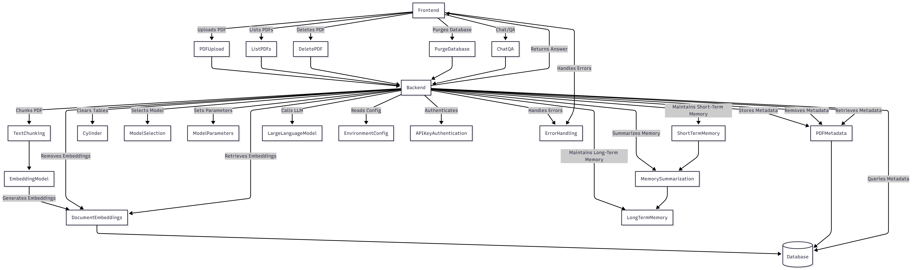

# PDF Document AI Assistant
- A web-based PDF document AI assistant utilizing React, FastAPI, PostgreSQL with pgvector, and Hugging Face API to deliver precise RAG capabilities over PDF documents.
# Requirements
- Python (v3.8 or higher)
- Hugging Face API Key
- PostgreSQL with the `pgvector` extension enabled (Docker)
- Node.js (v18 or higher)
## Key Feature
- A natural, context-aware conversational experience while significantly optimizing API token usage, this assistant implements a sophisticated hybrid memory architecture:
1. **Short-Term Memory (Sliding Window):** The system maintains a sliding window of the most recent `k` conversation turns. This guarantees the LLM has exact, word-for-word context for immediate follow-up questions, allowing it to seamlessly resolve references without losing the thread.
2. **Long-Term Memory (Rolling Summary):** To prevent exceeding the model's context window during extended sessions, older dialogue that falls out of the sliding window is not simply discarded. Instead, a background process generates and continuously updates a concise "rolling summary" of past interactions. This ensures the AI retains the overarching topic, previous findings, and user preferences indefinitely.
# System Architecture and Workflow



# How to Use
1. Clone the project to your local machine and navigate into the directory.

```bash
git clone https://github.com/andyting0619/PDF-Document-AI-Assistant
cd PDF-Document-AI-Assistant
```

2. Set up the Database. Make sure Docker is running. Create a new database and enable the `pgvector` extension, which is required for the RAG capabilities.

```sql
CREATE DATABASE "rag-pdf-chatbot-db";
\c "rag-pdf-chatbot-db"
CREATE EXTENSION vector;
```

3. Configure the Backend (FastAPI). Set up your Python virtual environment, and install the dependencies.

```bash
python -m venv venv

# Activate the virtual environment
# On Windows: venv\Scripts\activate
# On macOS/Linux: source venv/bin/activate

pip install -r requirements.txt
```

4. Start the FastAPI development server:

```bash
uvicorn main:app --reload
```

5. Configure the Frontend (ReactJS + Vite). Open a new terminal window, navigate to the frontend directory, install the Node dependencies, and start the Vite development server.

```bash
cd frontend
npm install
npm run dev
```

6. Open your browser and navigate to the local server address provided by Vite (usually `http://localhost:5173`).
